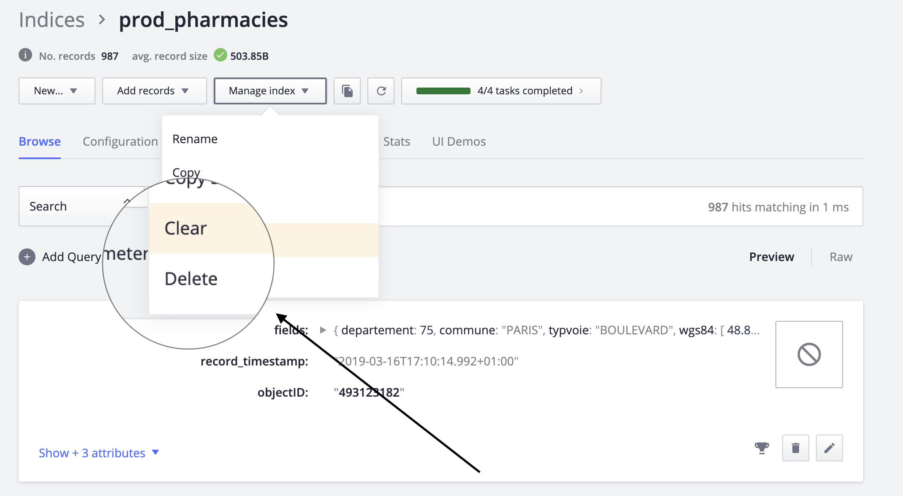

## Question 2:

 Hello,
Sorry to give you the kind of feedback that I know you do not want to hear, but I really hate the new dashboard design. Clearing and deleting indexes are now several clicks away. I am needing to use these features while iterating, so this is inconvenient.

## Answer

Hi Leo,

Lionel from Algolia.

I am so grieved to hear that you have had a poor experience with our new design.  I will bring your feedback up to our product manager. In the meantime, you can delete or clear your index in one click. I'll let you see my screenshot below:
 

Moreover, if you have any questions. Please, feel free to contact us.
